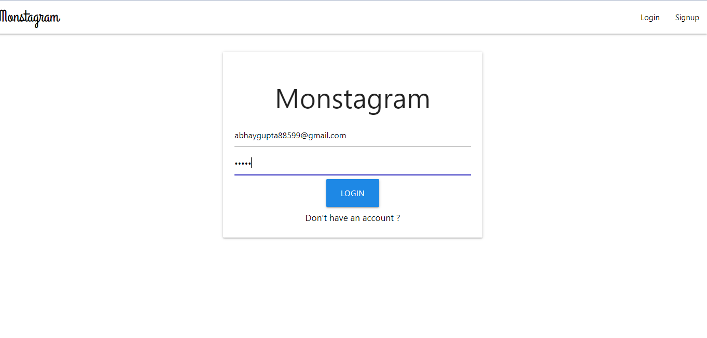

# Monstagram
<h2>Monstagram - a photo-sharing application and social network plateform like instagram.</h2>
<h3>SIGN UP PAGE </h3>
  
<h3>LOGIN PAGE</h3>
  
<h3>PROFILE PAGE</h3>
  
<h3>CREATE POST</h3>
  
  

  <h3>Use the following technologies:</h3>
 <h3>MONGODB   -M</h3>
 <h3>EXPRESS      -E</h3>
 <h3>REACT JS     -R</h3>
 <h3>NODE JS      -N</h3>
 <h3>Packages:</h3>
 <h4>Bcrypt JS - Npm package for encrypting and decrypting password. </h4>
 <h4>Json Web Token(JWT) - For secure token based communication between frontend and backend via API calls. </h4>
 <h4>REACT REDUX - For state management in our React application. </h4>
 <h4>Cloudinary - Cloud storage for storing images.</h4>
